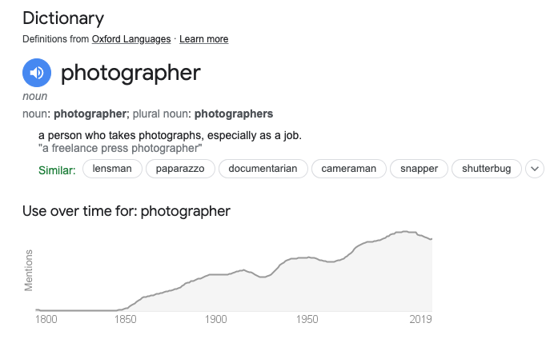
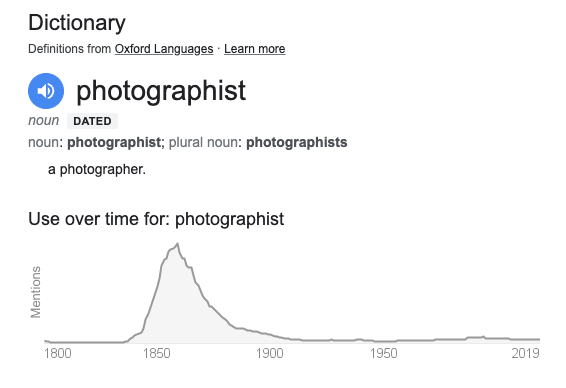

If a term applies to everyone then it isn't very useful. Now everyone takes photos all the time with their phones everyone is a photographer. The word is losing its meaning. Or it is beginning to mean just a guy (and it is usually is a guy) with a dedicated camera (probably an expensive one). I don't want to be that guy.

I came across the term photographist. It sounds incredibly pretentious but is probably more appropriate for what I do when I make photos using 19th Century techniques. It had dropped out of use by the 20th Century. Maybe we should revive it? The thought makes me cringe though.
