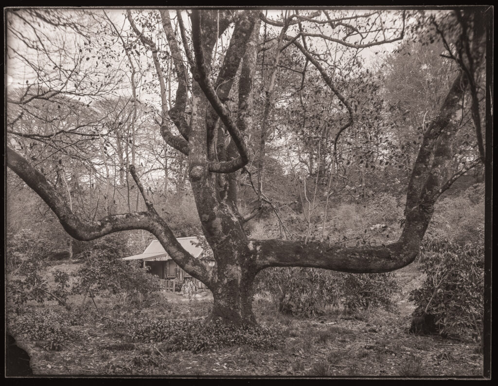

This shows the ancient magnolia by Brennan's Jubilee Hut at [Larachmhor Garden](https://larachmhor.co.uk/) near Arisaig. It has a colonial feel to it. (Whole plate, emulsion RH28, 2-bath development, flat scan)
