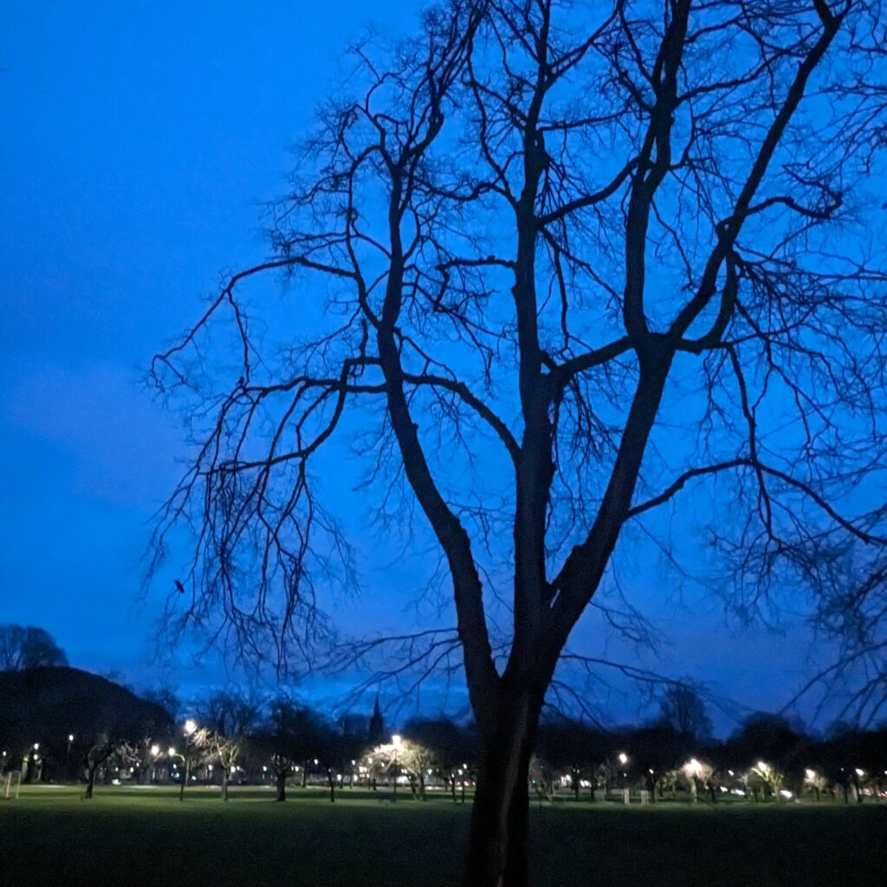

My first opportunity for a dedicated photo trip in 2024 was a few hours at [Tentsmuir](https://www.nature.scot/enjoying-outdoors/visit-our-nature-reserves/tentsmuir-national-nature-reserve) beach after running some errands. The walk was really pleasant and I enjoyed doing some looking but ultimately no exposures were made. It was a typical Scottish winter trip. Theoretically it is golden hour for all seven hours of daylight because the sun only reaches 11° above the horizon. This can lead to gorgeous light if the sky is clear but it seldom is. The light is travelling through so much atmosphere that any cloud at all makes life very gray indeed. The forecasters just can't predict the cloud cover and rainfall more than a few hours ahead. Heavy rain by 15:00 stopped play and led to an unpleasant drive home in the dark.

Looking at landscape photos online or in popular books you would think our world is 80% golden hour, 10% blue hour and 10% morning mist. It makes me want to do something different.

Phone snap of Meadows in Edinburgh whilst walking back from the shops, 16:30 on 27th December. There was the faintest glow in the sky that is amped up by the phone.

