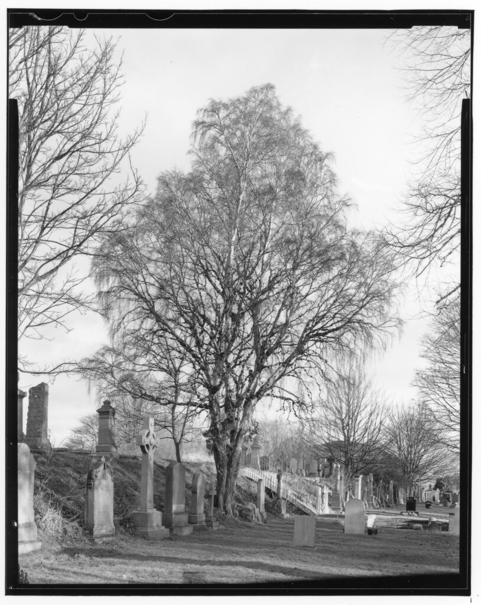
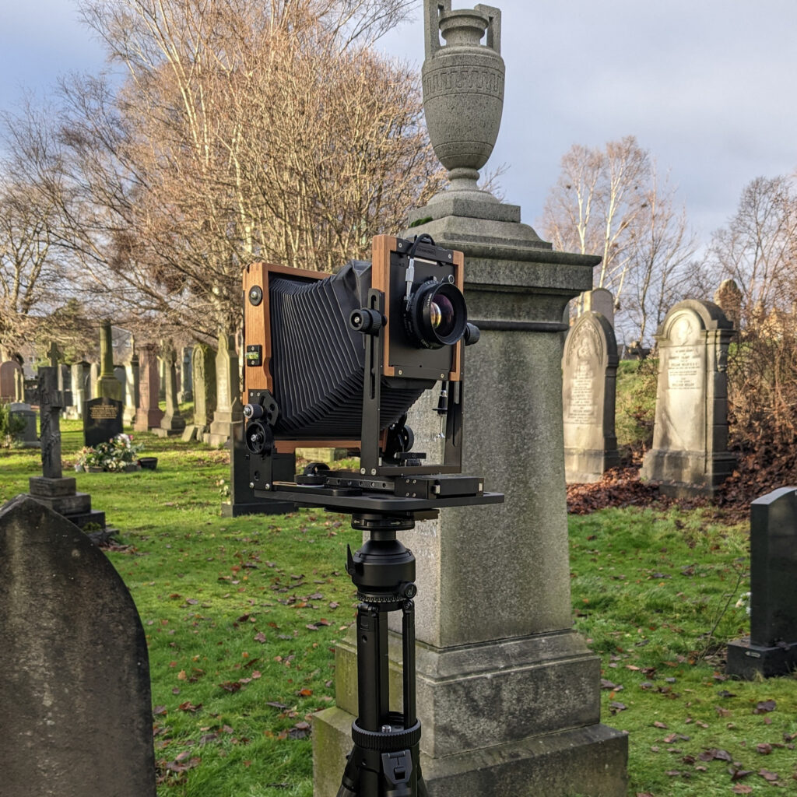

I went to the local cemetery to break the block I inevitably develop over the Christmas and New Year period. It is so dark here. First shot of the year with my new favourite camera on a very light weight tripod - more on that another time. Do you spot the rookie mistake?

After so many years of doing this I still don't always check my edges. I have bellow vignet at the bottom of the negative that I missed. It is not a shadow. I could crop it out if I was enlarging but I like to work on the basis of always contact printing the entire neg. There is a whole philosophy behind that.
