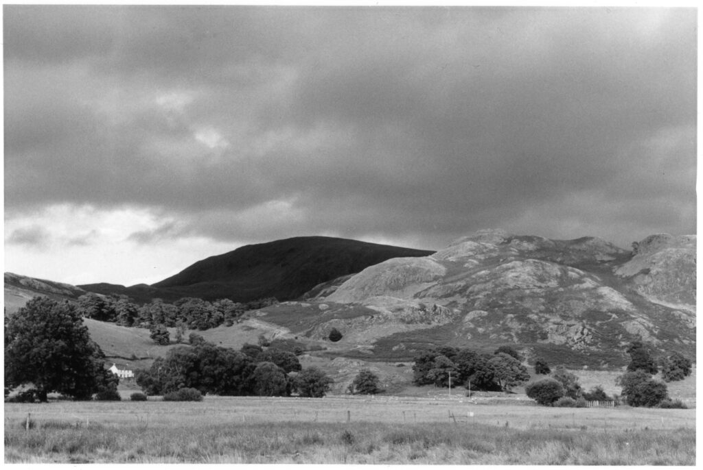
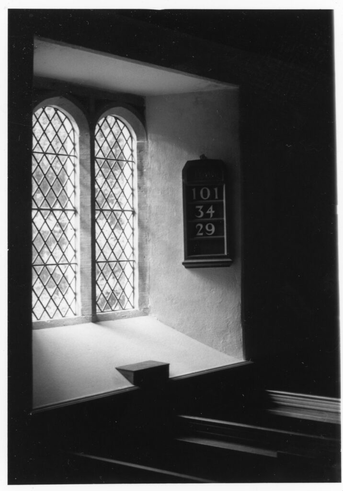

I bought half a dozen roles of Kodak Double-X from a guy on eBay who breaks down 250 ft lengths into 36 exposure cassettes. Double-X is a motion picture film that has been produced since the 1950s. Most recently it has been used by Christopher Nolan for the black and white scenes in the movie Oppenheimer.

This is a view of St-Johns-in-the-Vale in the English Lake District. And another shot in the church that lies in crook of the valley itself.

I do like the tonality and could live with the grain too but wonder if the advantages outweigh just going with an old familiar like Ilford HP5 Plus. These shots were developed in Ilfotec-HC (same as Kodak HC110). I'd like to try it in D23 but that might be too soft.

(These are quick and dirty work prints as ever!)
