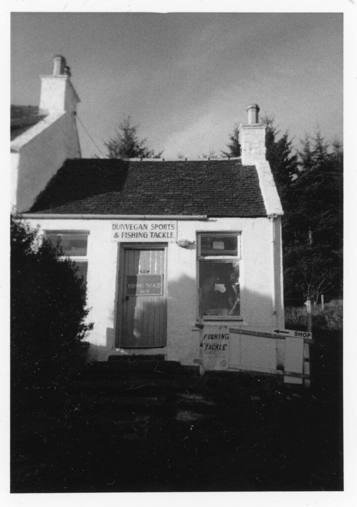
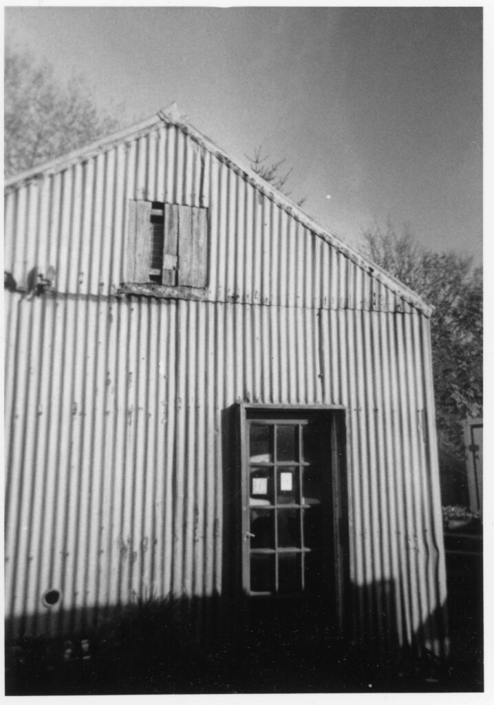

Back in April I bought a HOLGA 135 Smart 35mm Film Camera from Amazon for the massive sum of £12.95. It was the cheapest reusable camera I'd seen so just had to give it a go. I loaded it up with some Fomapan 100. A 400 ISO film would have been more appropriate but I keep a bulk roll of Fomapan for testing and messing about like this. It is probably the cheapest film you can get. Then I took the camera on my trip to the Isle of Skye. Here are a couple of shots from walking around Dunvegan one evening.

This was the same trip as I photographed [Brenan's Hut](https://www.hyam.net/blog/archives/19455) and the [fallen tree](https://www.hyam.net/blog/archives/19452) at Larachmhor Garden (on the mainland). To be honest it was as much fun using this "toy" as my 1900 whole plate camera.
