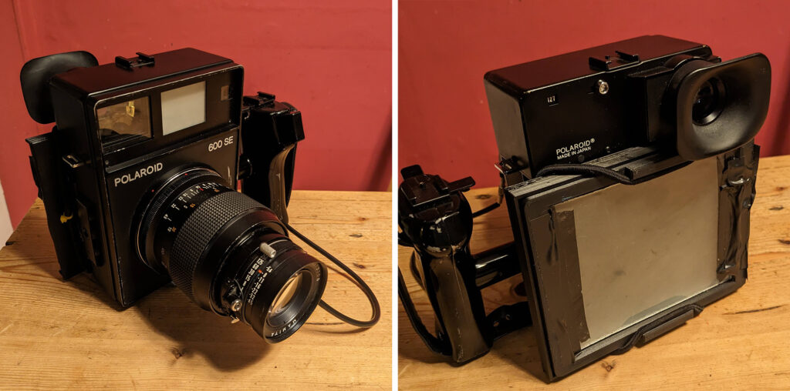
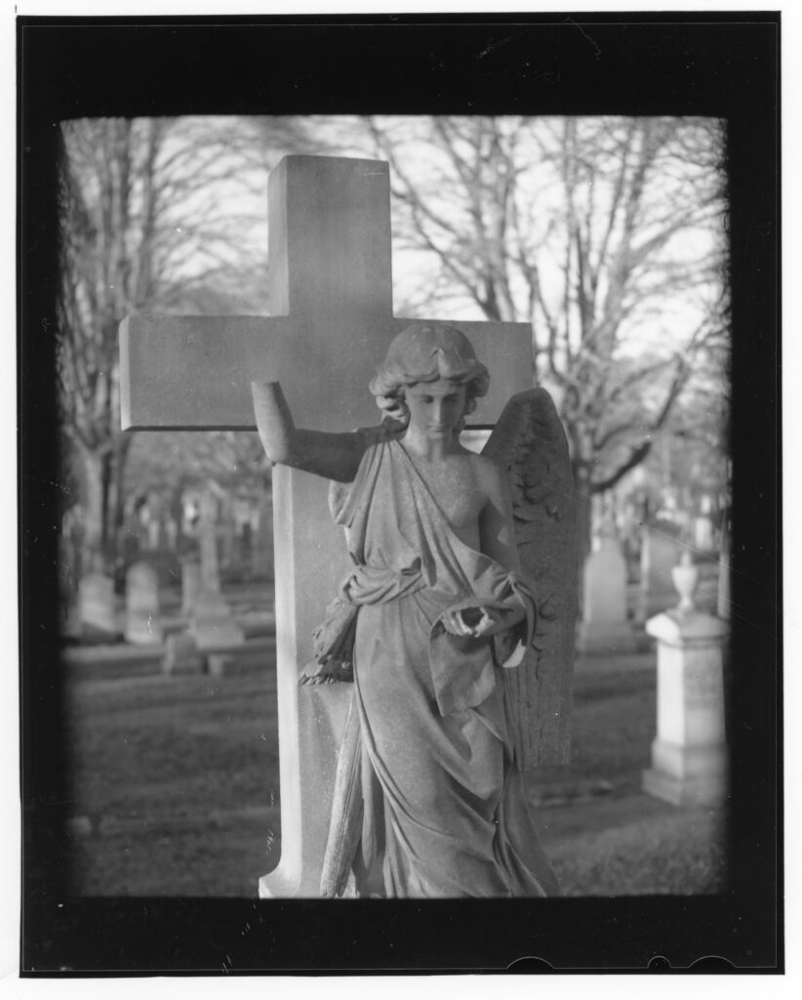

There are so many things that I've had a play at and not documented. Here is another. Back in 2021 I [printed out a WillTravel camera](https://www.hyam.net/blog/archives/10371) for use with a Fujifilm Instax back - but also an adapter so I could use it with regular 4x5 film. This is what the original WillTravel camera was designed for. Having messed with it for a while I binned it - kept the parts obviously. It wasn't fun to use for me because it was a bit too plasticy. It was 100% made of plastic! The idea of a walk about 4x5 camera stayed with me though so I assembled a Polaroid 600SE from sketchy bits off eBay and printed out a 4x5 back so I could use regular 4x5 holders on it.

The 600SE (known as the GOOSE) is a bastardised version of the Mamiya Universal produced by Mamiya for Polaroid. The lenses and backs were deliberately made to be incompatible between the two cameras so that Polaroid could sell the geese at a discount and not eat into Mamiya's sales. Polaroid, after all, made their money off the film whilst Mamiya had to make a profit from the cameras. Because Polaroid pack film is dead the GOOSE is pretty useless these days unlike the Mamiya Universal, lenses and backs which work great with 120 film if you don't mind the weight. That doesn't stop enterprising individuals selling geese for good money!

Polaroid pack film was smaller than 4x5 inch sheet film (4.25 × 3.25 inches I believe) so I wasn't expecting full coverage and the wider lenses would be stupidly wide with lots of fall off but might look good.

Having discovered I could build the thing and get it to work with a 150mm lens I lost interest as usual. But today I thought I'd take it for a spin again. Why exactly had I put it to one side? Would it be fun to use?

Here is a test shot from this morning. I kinda like it. I focussed on the angel's face at f/8 but it is soft compared to the cross behind. I'd need to do some more work on calibration of the rangefinder. If I had a project where it seemed appropriate then maybe it would be fun. But the thing is as awkward to carry as a real live goose. So maybe not such fun after all.
