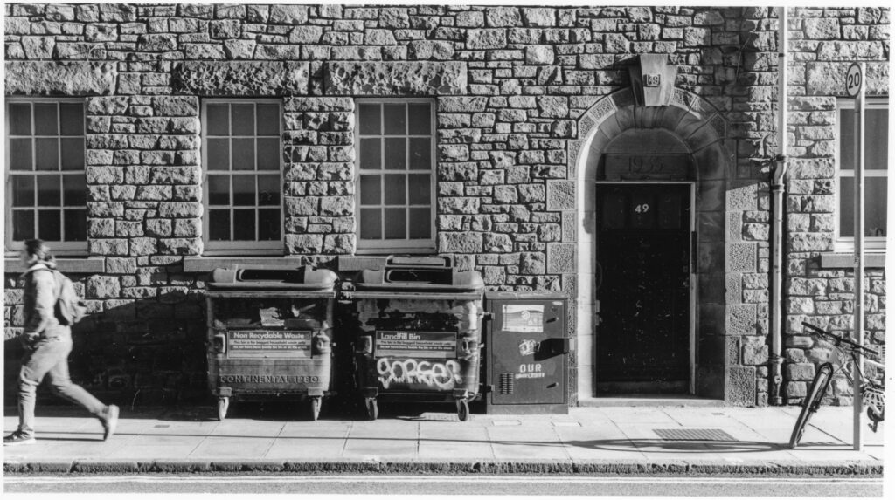
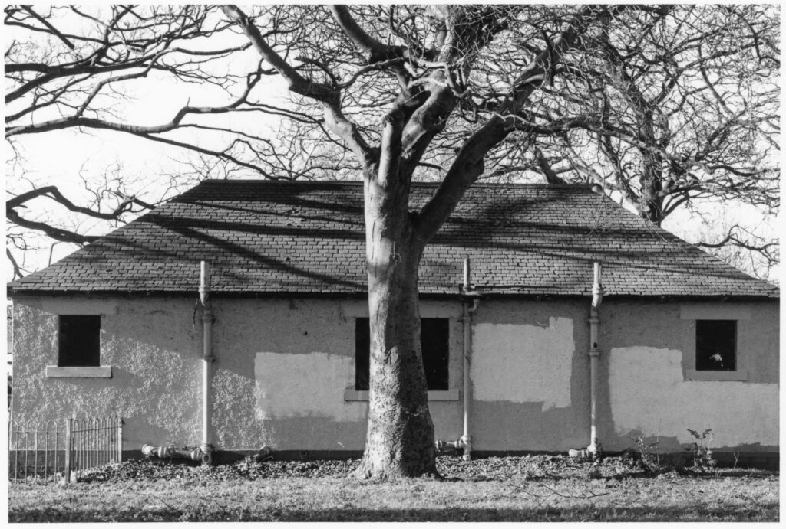
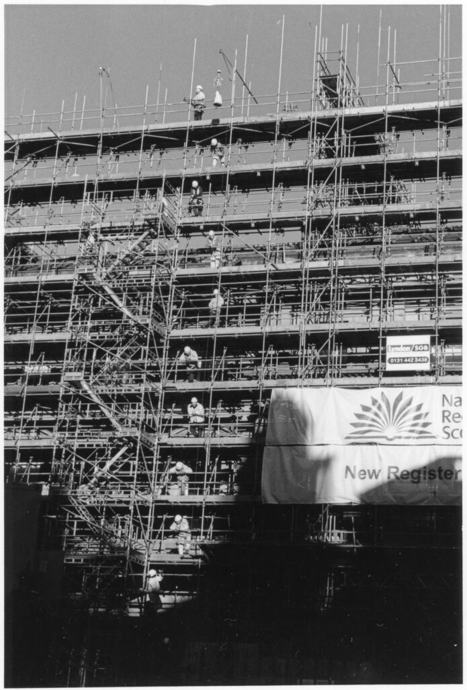
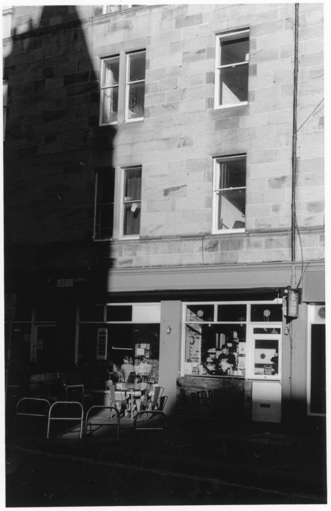
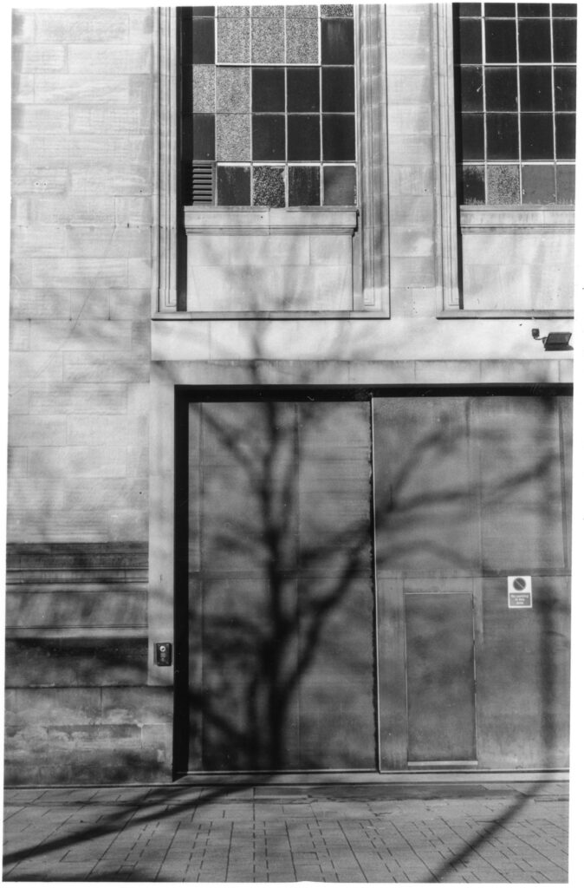

Double X is movie film stock manufactured since the 1950s and never officially sold for stills. The smallest lengths available are 400 ft reels that cost around £250. It is perfectly feasible, if time consuming, to manually split these down into 36 exposure rolls. You get about seventy from a 400 ft length. That is £3.60 a roll or 10p a shot which is pretty good value. The downside is that it is quite a commitment. You have to love the stuff to shoot seventy rolls of it.

I bought half a dozen 36 exposure rolls of Double X off a guy on eBay for roughly double the bulk loading price - which is reasonable as he had gone to the trouble of putting them together. I thought that if I really liked the character of the film I would maybe buy a 400 ft reel for myself. I've [shared before](https://www.hyam.net/blog/archives/20898) a couple of the landscape shots I took on the film.

I really like the tonality you get from this film if the light is right. The blacks do have something about them that appeals. The grain is quite distinct and big but I can happily live with that. On the downside it isn't that sharp. I guess the micro-contrast isn't needed in a film that is intended to be projected at 24 frames per second rather than stared at, one frame at a time.

My initial plan was to use it with two bath developer to control the highlights but that proved to produce pretty thin negs. I ended up using Ilfotec HC and then D23 stock. The D23 was probably my prefered approach. Perhaps another developer would have given more acutance.

These are some darkroom prints from my last roll. My conclusion is that I really like this film. I could see myself buying 400 ft but not just now. The advantages over something like Ilford HP5 Plus aren't that great.

I think I'm going to concentrate on Ilford HP5 going forward. I can shoot it at 35mm and 4x5 and really get to know it. I still have plenty of Fomapan 100 to use up but once that is gone I'll be left as an HP5 guy - for a while.
