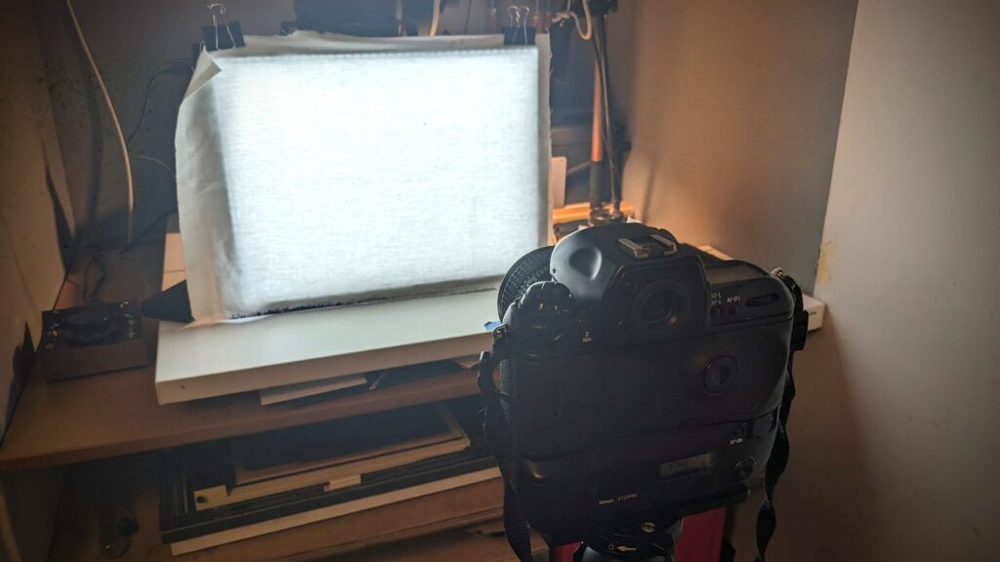
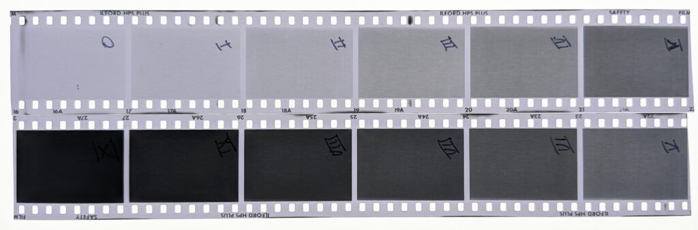
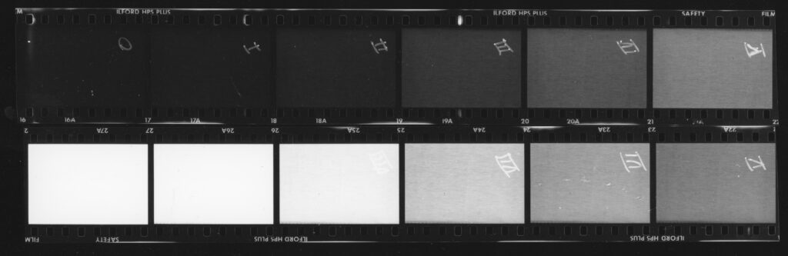
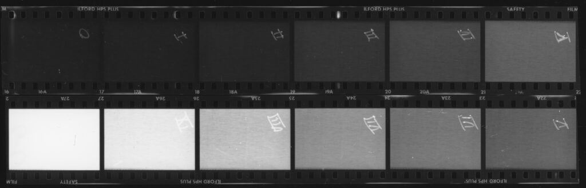
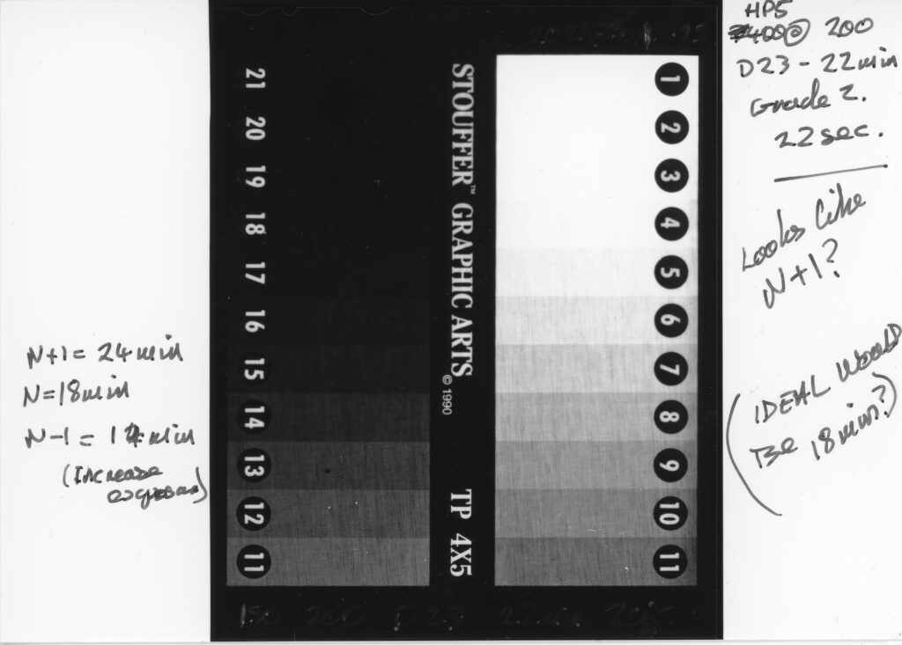

I've been at this a long time (decades) but I think I finally have enough understanding to get a routine film/developer calibration process running. Thirty years ago I tried to do the full Ansel Adams' Zone system process with measuring densities above base fog and stuff. I just used to get very thin negs. I don't think I ever really "got it" - especially reciprocity and bellows extension! I've probably matured a bit in my general approach since then. I'm not in so much of a hurry.

Most recently I've been using the [system designed by Alex Bond](https://www.alexbond.com.au/film-speed-test/) based on a [Stouffer step wedge](https://www.stouffer.net/Photo.htm) for 4x5 film. It is a good system and led to what I'm going to describe below. Mat Marrash made a great video that goes through Alex's process that is [worth watching.](https://youtu.be/pN-LM1lM8Kg?si=ebs4bF0SKZN4La_z) Several things have made me come up with my own variation. Firstly I live in a flat in a country that is dark and cold for a lot of the year so I need a system that will work indoors on a winter evening. Second I mainly use 35mm and 4x5 formats and therefore need a system that will work for both. Thirdly I've started experimenting with Kodak D23 developer with replenishment. This means I need to be able to make test strips like commercial labs use to monitor my developer. Finally, and most importantly, I just don't get all this stuff with **tones**! I think about **texture** far more.

We have to talk in terms of the Zone System. If you are unfamiliar or intimidated by it don't worry. The Zone System is a religious belief system that permeates photographic culture like the abrahamic faiths permeate Western culture. It doesn't matter if you don't believe in the teachings of the great prophet Ansel Adams or not. It has established the language we use to describe the tonal values (densities) in subject and final print and it is very useful. (I think I could write a compelling piece arguing that even the great AA didn't actually **use** the Zone System sensu stricto and certainly not for his most famous works. I'll maybe leave that magnum opus till I retire.)

The Zone System divides values of light and dark (tones) in a monochrome print into eleven zones from totally black at zero to paper white at ten. Obviously this is a continuous scale in reality. We use the language of zones to chunk it into things we can talk about - like dividing a foot into twelve inches or a metre into one hundred centimetres. These chunks equate to Exposure Values. Each Zone is a one stop change in exposure, a doubling or halving of exposure. The zones are represented by Roman numerals plus zero. Real Romans didn't use zero but we do.

Incase you don't have your copy of ["The Negative" by Ansel Adams](https://shop.anseladams.com/products/ansel-adams-the-negative) to hand (surely you have a copy!) here is a brief summary of the eleven Zones with my spin on them.

- **Zone 0:** As black as it can get. Like you left the paper out when you turned the light on by mistake.

- **Zone I:** Not quite black anymore.

- **Zone II:** Some hint of **texture**. Deep tonalities.

- **Zone III:** Dark but actually useful, **descriptive texture**. You can see what is there.

- **Zone IV:** Normal shadows.

- **Zone V:** Middle, 18% gray. This is the gray of "The Gray Card" you can buy. It is the tone that a reflective light meter assumes the scene is on average.

- **Zone VI:** Normal highlights

- **Zone VII:** Light, **descriptive textured** highlights.

- **Zone VIII:** Very light highlights - still with some hint of **texture**.

- **Zone IX:** Very light highlights without texture.

- **Zone X:** Paper white. Like the paper was never exposed.

The zones describe the values on the **print** not in a real life scene. The lightest a print can be is the amount of light a piece of paper can reflect at you. The darkest is the relative amount a black area can absorb. In an original scene the sun is so bright it will burn your eyes out and the darkest areas are invisible to us. Pieces of paper aren't like this. What is more our eyes adjust as they flick around a scene, continuously varying how brightly we see it. Those Zone II areas become Zone IV if you pay attention to them. The art of photography is (or used to be) converting the immense range of brightnesses and colours in a three dimensional world into monochrome marks on a flat piece of paper. This involves choices, looking at the scene and **pre-visualising** what it could look like on paper. These choices reflect the artist-photographer's feelings about the scene. In essence, that is what the Zone system is all about.

The way it works in practice is the photographer uses a light meter to meter part of the scene and decides what zone to **place** it on. By default the light meter will indicate the camera settings for **Zone V** (mid gray). If the photographer uses the settings suggested then that area of the scene will come out mid gray on the final print. The photographer can tell where the other parts of the scene will **fall** on the scale by measuring their relative brightnesses with the light meter. They don't have to take the settings recommended by the light meter though. They could choose to place the first area on Zone III (by under exposing two stops) and then see where the other areas will fall. They can get a good idea of how the final print will look given the choices they make during exposure. They can also adjust the development of the film to increase or decrease the spread of the zones.

For all this to work the photographer has to know how the film, developer and paper will respond, relative the light meter readings. This, at last, is the actual subject of the blog post! How do you make sure that if your light meter says X you can reliably place that on a particular zone and estimate where the other parts of the scene will fall given certain film/developer/paper combinations? You need to have a feel for your equipment and materials. Here is my approach.

You can see from the descriptions of the Zones that the scale goes from no texture to lots of texture then back to no texture. For just five of the zones (Zone III to Zone VII) there is what I call "descriptive texture". Check out "The Negative" for lovely photographs illustrating all this if you can get your hands on a copy.

When I'm more deliberately making a photo I tend to measure the darkest area that I want to record detail in and place it on Zone III or Zone IV. This involves taking a reading then under exposing by a stop or two. I then measure the area that has highlights I need to capture texture in. It should be about 5 stops above the low reading. This isn't such a worry on modern black and white film because we can print through or hold back development. The important thing is to get enough detail in Zone III to be able to print the dark details. If they aren't captured then you can't print them. This is what I think of as the "true ISO" of the film. Increasing development only affects these areas a little. This is why you can't infinitely push film speed. Pushing film will increase density of the mid tones (Zone V, 18% gray) and high tones but not the shadows. This is fine if you are primarily interested in the mid tones. The film will appear faster. But if you are after a full range of tones you will miss the shadows.

Nikon F5 shooting test strip of muslin covered light box.

The picture shows the setup I use for 35mm. You could do something similar but specific to your equipment. I take an LED light panel and cover it with a coarsely woven white cloth. A cheesecloth would do. I prop it up and set the camera so the panel fills the whole frame. Focus the camera. I'm using a Nikon F5 so I use programme exposure mode, center weighted metering and autofocus. I want the weave of the cloth in focus as texture but I'm not bothered if it is totally parallel or anything. For the first test on a new film I'd set the ISO to half the speed written on the box. I then use the +/- exposure compensation to make twelve exposures, at each whole step from -5 to +5 with two at 0 in the middle. It would be eleven exposures if you didn't do two at 0 but those two frames are really useful. Things to watch for are exposures going over 1 second where you may fall into reciprocity issues but depth of field doesn't matter so you can open up the lens as much as you like to avoid this. Also if you are not using through the lens metering you will need to allow for bellows extension - see below.

I develop the film and cut the negatives into two strips of six exposures, splitting it between the two frames that are the same density as the first cut. This makes things easy because the very underexposed frames may appear almost blank. I write the corresponding Zones onto the negatives with a fine sharpie. The double frames in the middle are Zone V and the others step out in either direction to Zone 0 and Zone X. Here is what the strips look like.

HP5 Plus @ ISO 200 in D23r Stock for 16 minutes

This is looking really good to me. There is good textural detail in Zone III and even a little in Zone II. Zone VII shows good detail and I can just about see it in Zone VIII. This is supposed to be a soft working developer so the results are not unexpected. But the object of the game is not to produce negatives. If you were to scan this you could get nine or ten stops of dynamic range which would be fine. You could move the sliders around in Adobe Lightroom and get something good on screen or out of your inkjet printer. Stupidly I prefer analogue darkroom prints so let's try that instead.

HP5 Plus @ ISO 200 in D23r Stock for 16 minutes on Multigrade Grade 2

When contact printed on Grade 2 multigrade the examination of the negative is confirmed. We get texture in Zones III and VII with a hint in II and VIII. This means images on this combination of settings should print predictably and controllably. If we print at Grade 0 we can get more detail and obviously less at higher, more contrasty grades.

HP5 Plus @ ISO 200 in D23r Stock for 16 minutes on Multigrade Grade 0

The benefit of this approach is that it is fast to set up and repeatable. I can add a test to the beginning or end of a roll of film I'm using to make images or I can roll a short length specifically for this purpose. I can therefore keep an eye on my stock developer and see if it is changing.

HP5 Plus 4x5 @ ISO 200 in D23r Stock for 22 minutes on Multigrade Grade 2

I take the same approach to testing 4x5 film. I use the Stouffer step wedge placed in contact with the film and make a single exposure, basically following the process outlined by Alex and Mat. Because I am doing this in a confined space I have to be careful of two things. There is no through the lens metering on a 4x5 camera so I have to compensate for bellows extension which is x2 in my setup. This means I take a reading and open it up six full stops! That means it is very easy to get into reciprocity failure territory especially with slower large format lenses. I find it just about works for ISO 200 @ f/5.6 and 1/4 second but it might not be convenient for much slower films.

Let me know in the comments below if this has been informative or you think I'm doing something terribly wrong!
