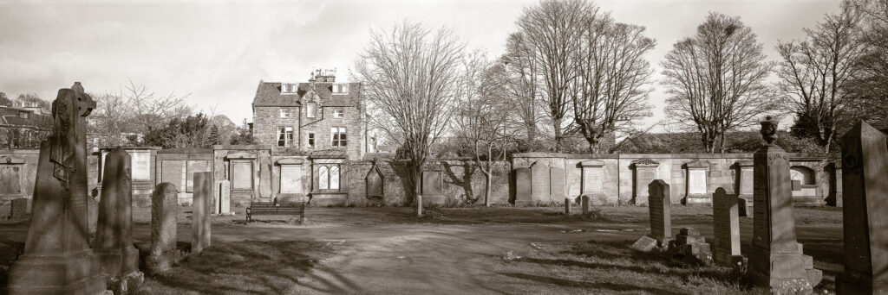
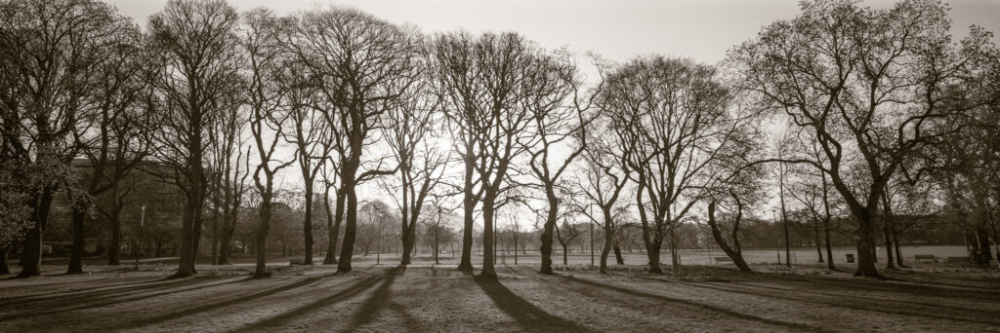
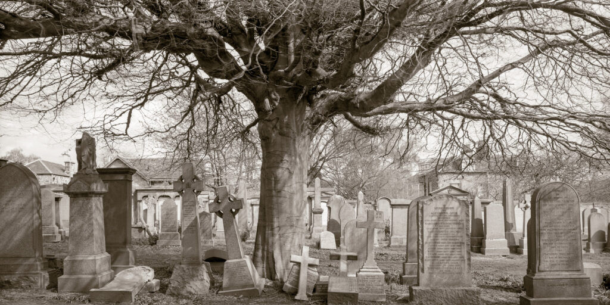

Another crazy, impulse purchase has occurred. I bought a [Tomiyama Art Panorama 170](http://camera-wiki.org/wiki/Tomiyama#Art_Panorama_170). The 6x17 format is something I've always fancied trying. Having messed about with swing lens cameras of various makes and formats I wondered what it would be like to make really wide, rectilinear panos.

My first exposure in Grange Cemetery, Edinburgh - my testing ground.

The choices to shoot 6x17 are limited. The most flexible camera would be one of the dedicated [Shen Hao view cameras](http://www.shen-hao.com/index.php?s=product&c=category&id=7). These are gorgeous but pricey. Another option is to get an adapter back for one of my 4x5 cameras. These are let down by the lens support. You need to use a recessed lens board for a 90mm lens (which can be a complete pain) and then get restricted movements on a regular field camera. The longest focal length useable is about 180mm before vignetting occurs on the internal 4x5 aperture of the host camera. That means that, out of the box, I could only use my 150mm lens with an adapter. I could remount my Schneider 90mm Super-Angulon on a recessed board but that would make it harder to use on normal 4x5 film. Adapters are tempting because they are cheaper than a dedicated camera but they come with restrictions and hassles that add up.

From my second roll of film. Trying out a monopod. I need to get used to the framing in the viewfinder.

There are some modern, 3D printed, dedicated 6x17 cameras but I've [used 3D printed cameras before](https://www.hyam.net/blog/archives/10371) and they didn't spark joy. That leaves dedicated cameras with a viewfinder on top. Of these there are the Linhof Technoramas and the Fujifilm GXs. These are good but rare and come in at over £2,000 often with extra shipping and import duties. They are also more complex than view cameras in having sophisticated winding mechanisms. The Tomiyama that I have bought is a bit of an oddball. It feels more like a piece of industrial equipment than a refined production camera. Its construction is simple and it has a basic peep-window film advance that can't go wrong. It was also a lot cheaper than a Linhof or a Fujifilm!

https://youtu.be/MlFEqZeg1mM?si=8m8GdM46oUSh-UwT

Here is Nick Carver (Mr 6x17 himself) with a much more detailed break down of the camera options

The other thing that tipped me towards a viewfinder style camera is the Scottish weather. Often it isn't clement enough to wrestle with a focussing cloth, bellows and movements. I have view cameras that I don't get to use because of the wind and rain so something that is a little more robust is attractive. Having said that, after three rolls of film I'm already missing movements! A rise and fall front would be nice. This is partly because I'm stuck in town for a while and any tilling forward and backwards of the camera is betrayed by verticals at the sides of the frame. This won't occur so much in natural scenes.

Not 6x17 but 6x12 using my Cambo 6x12 back

Two interesting side effects of my purchase are that I've suddenly become relaxed about scanning negatives. I'd been going through a phase of only darkroom printing but this isn't practical with 6x17. The lack of movements on the Tomiyama also inspired me to get my Cambo 6x12 holder out again. This is a nice film holder for 4x5 that slots behind the ground glass. The workflow for using this holder is like using regular sheet film holders and much preferable to having to remove the focussing screen to fit a Graflock film adapter. The last time I used it I had a light leak I couldn't solve but now I think the leak may have been due to the camera it was on rather than the holder itself. The Cambo holder also has a tendency to mangle films if you aren't careful!

This could turn out to be a nice combination: The Tomiyama for full 6x17 in specific landscape settings. The 6x12 back on my Chamonix for more controlled, but less wide, panoramas.
