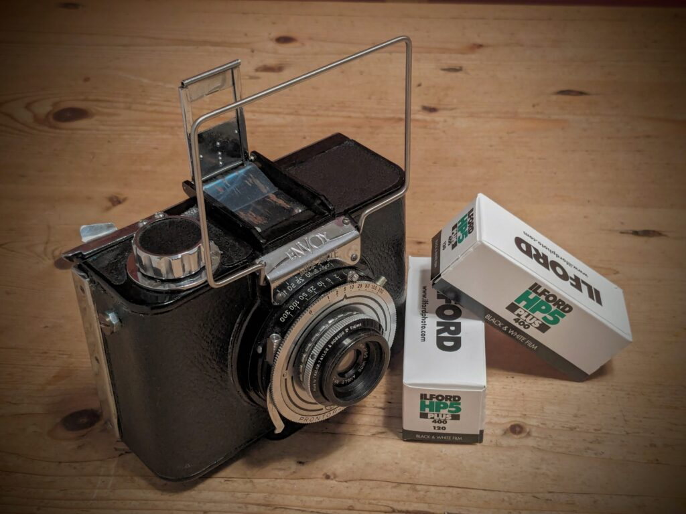
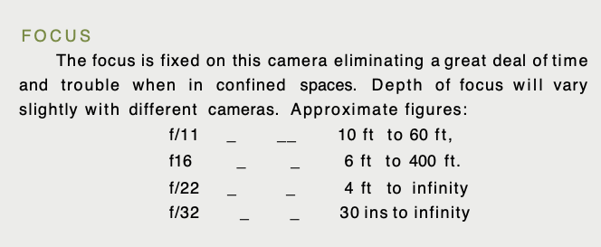
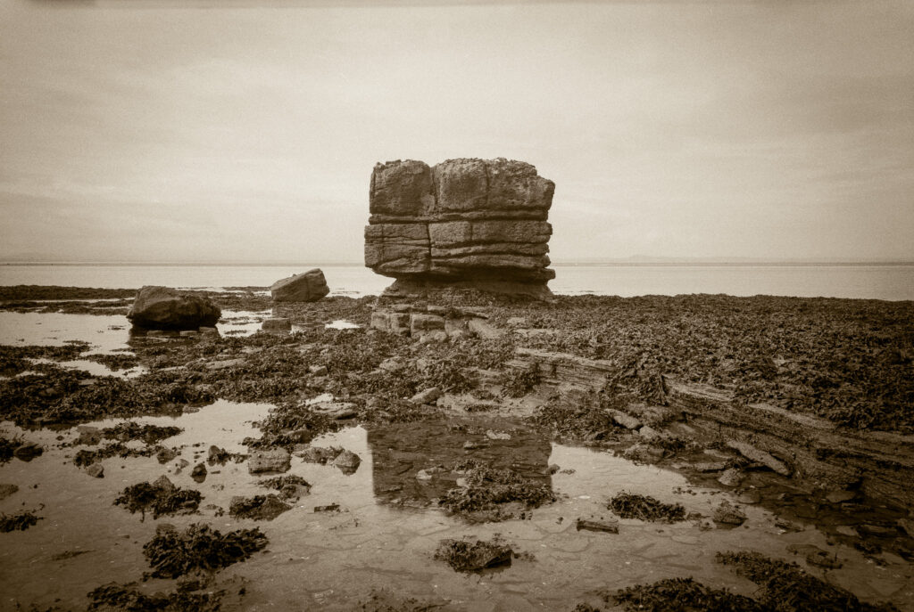
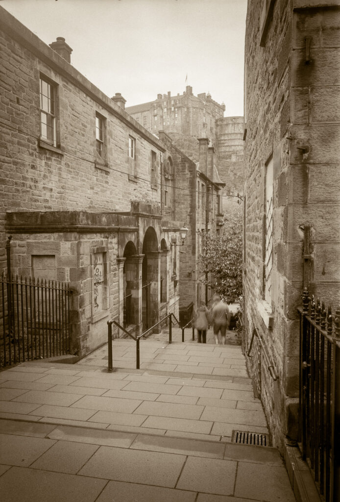
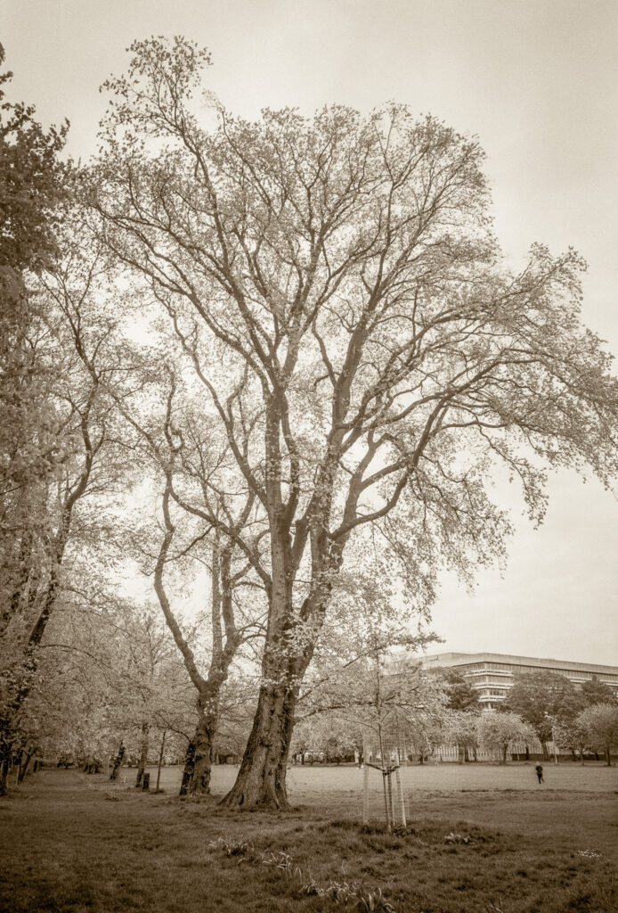

My brother kindly gifted me an _Envoy Wide Angle_. This quirky little camera was sold by Ilford in the 1950s. Although it has the same name as the mass market, plastic _Ilford Envoy_ it is a very different camera and relatively rare. It has a diecast metal body and quality, 64mm lens (equivalent to about 24mm on 35mm). It can take plates or a 120 roll film insert. But it is a fixed focus camera like its namesake - relying entirely on depth of field for sharpness. (Albeit the Envoy does two push/pull focus settings).

Depth of field range from instruction manual.

This particular specimen had quite a bit of "history". At some point in its seventy year life someone had converted it from taking 9x6cm frames to 6x6cm frames. They cut holes in the pressure plate and back that lined up with the 6x6 numbering on the film and stuck cardboard baffles onto the film carrier. Although this sounds barbaric it was probably quite a good idea at the time. 6x6 is easier to work with and it gives 20% more photos per roll. Unfortunately, in 2024, it makes it much less attractive as a collector's item. I decided to reverse the changes and take it back to 6x9. Functionally it now works the same as when new but it looks pretty hacked about from behind.

Fossil headland at Aberlady (vignette added in post)

In use it is a case of _liberation through limitation_. Although it is tiny you really have to put it on a tripod. At f/16 it would be in focus from 6ft to 400ft but the instructions say coverage is not 100% till it is shut down to f/22. Using the sunny sixteen rule that means that ISO 400 film will need 200th of a second in full sun. The reproduction ratio means this is the minimum you can hand hold it really. It never is full sun and I rate my 400 films at 200! Effectively you always have to put it on a tripod. Just set it to f/32 frame your shot (the wire frame is quite accurate) and choose a shutter speed.

Compulsory photo of Castle Vennel, Edinburgh

As usual the Edinburgh weather is dull but I had fun and the shots are quite pleasing. They are sharp though I don't really care about such matters. Another working camera for the collection.

Meadows, Edinburgh. Basil Spence designed library behind.

