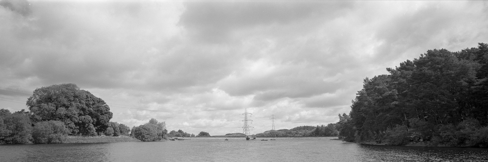

We are a bunch of social [primates](https://en.wikipedia.org/wiki/Primate). This means we have two biological driving forces. Firstly we want to fit in. We fear being ostracized by the group because that would mean death. Even if we are inveterate loaners we have to negotiate a relationship with society that supplies us our sustenance in return for everyone leaving us alone. Secondly we want to get on. We seek status within the group so that others know how to relate to us. Higher status means more comfort but status is more of a role in a complex machine than simply a position on a ladder. Witness people defining themselves by their job or their family responsibilities. You can have a status as the unreliable cleansing operative or a big corp CEO but it is still **your** status. You aren't a nobody. You are always defined by everyone else even if that is via negation.

[Alfred Alder](https://en.wikipedia.org/wiki/Alfred_Adler) was a contemporary of Freud and founded the school of individual psychology. In recent years Alder's psychology has been popularised by the [Ichiro Kishimi](https://www.amazon.co.uk/Ichiro-Kishimi/e/B004LPLOC8/ref=dp_byline_cont_ebooks_1) and [Fumitake Koga](https://www.amazon.co.uk/Fumitake-Koga/e/B07FM42SQF/ref=dp_byline_cont_ebooks_2) notably with their book "The Courage to be Disliked". In summary: "Unless one is unconcerned by other people’s judgements, has no fear of being disliked by other people, and pays the cost that one might never be recognised, one will never be able to follow through in one’s own way of living. That is to say, one will not be able to be free."

And the trap snaps closed! We are biologically programmed to be people pleasers but can only be creatively free if we are unconcerned what people think of us and our work.

"Existential angst", sometimes called existential dread, anxiety, or anguish, is a term common to many existentialist thinkers. It is generally held to be a negative feeling arising from the experience of human freedom and responsibility. The archetypal example is the experience one has when standing on a cliff where one not only fears falling off it, but also dreads the possibility of throwing oneself off. In this experience that "nothing is holding me back", one senses the lack of anything that predetermines one to either throw oneself off or to stand still, and one experiences one's own freedom. ([Wikipedia Existentialism: Angst and Dread](https://en.wikipedia.org/wiki/Existentialism#Angst_and_dread)).

Photographic angst is that feeling you get when you realise you don't have to make photographs to please people. You could photograph anything anyway you want. You freeze as if stood on the edge of a cliff. It is an intently negative, paralyzing sensation usually solved by distraction onto something else - perhaps trying to produce something to please people but more likely despising those that do it successfully!

## Fortunately there is an out

In considering the group and us we are committing a [category error](https://en.wikipedia.org/wiki/Category_mistake). We **are** the group and our status within the group is in relation to everyone else in the group. Our actions are the actions of the group and as such we have total freedom. To say we are constrained by our group membership would be like saying our right hand is restricted by our left hand. Sure there are limits on our freedom. We can't threaten harmony too much but outside of oppressive, authoritarian societies these should not be considered a prison. It would be like saying you weren't free because gravity prevents you flying. Dancers and acrobats use that gravity.

If being a member of a troop of monkeys does not restrict us then what of Alder's comments, that we can only be free if we overcome our need for approval? That remains true. There is a difference between seeking approval of the group as a goal and being pleased when you receive that approval. If one were to actively seek to **not** court praise one would be restricting oneself to a limited range of expression almost as much as if one were to only seek praise. Rebels are defined by what they rebel against. What Alder is really implying is we need to take risks to be free. We need to be OK with not getting group approval.

Standing back on that existential cliff edge things look a little different. We do not have absolute freedom. Our group membership is holding us back because as group members we have a responsibility to the whole group not just ourselves. This isn't a constraint because "ourselves" and the group inter-are. What scares us now is that what we thought was a very personal creative drive is actually a responsibility to lead. Simultaneously acknowledging responsibility within the group and a freedom to act in a way you feel right, even if it makes you unpopular, is a pretty good definition of leadership. We can ask ourselves what kind of photographs should be made. If we are capable of making them then get on with it and if we aren't then encourage others to do it.
