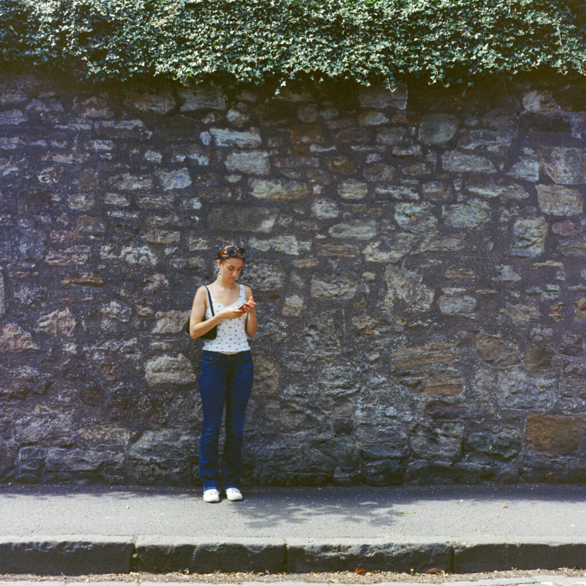
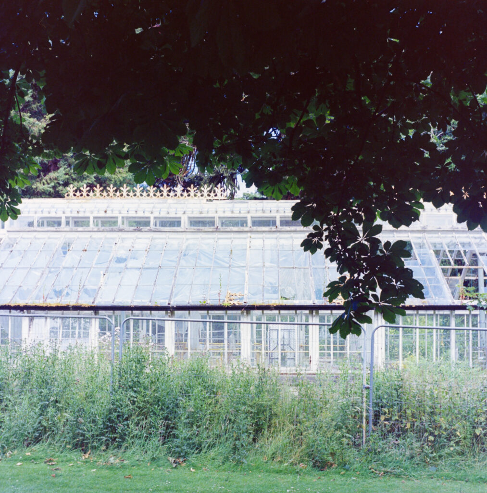
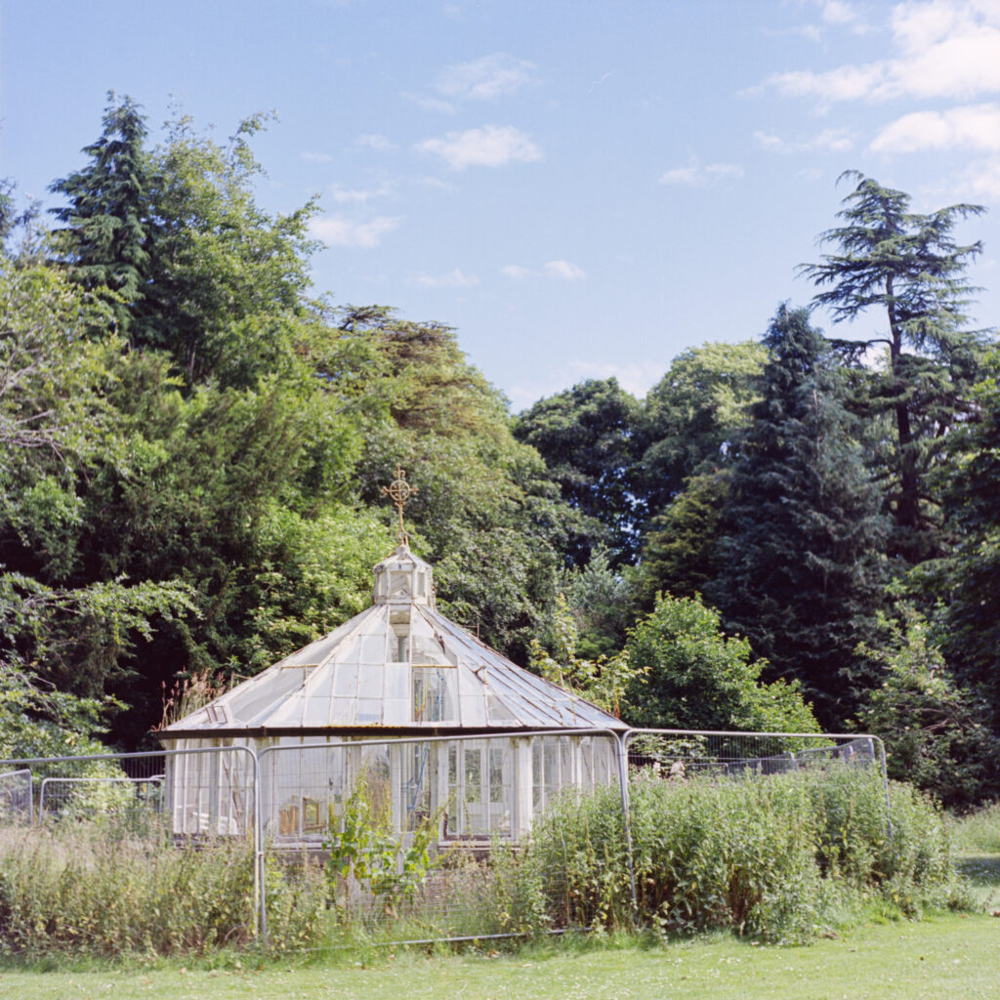
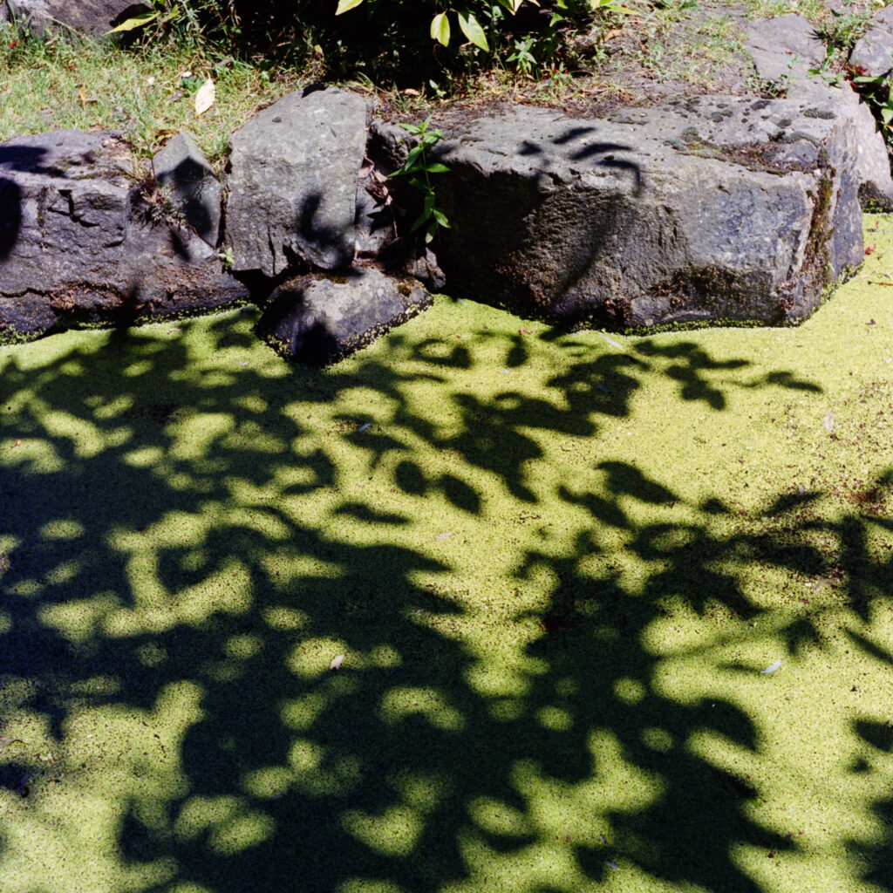
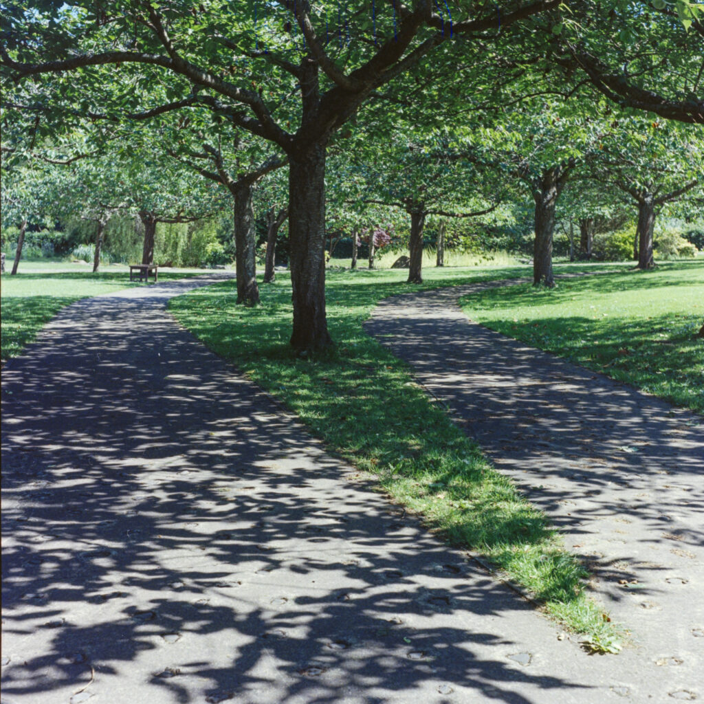
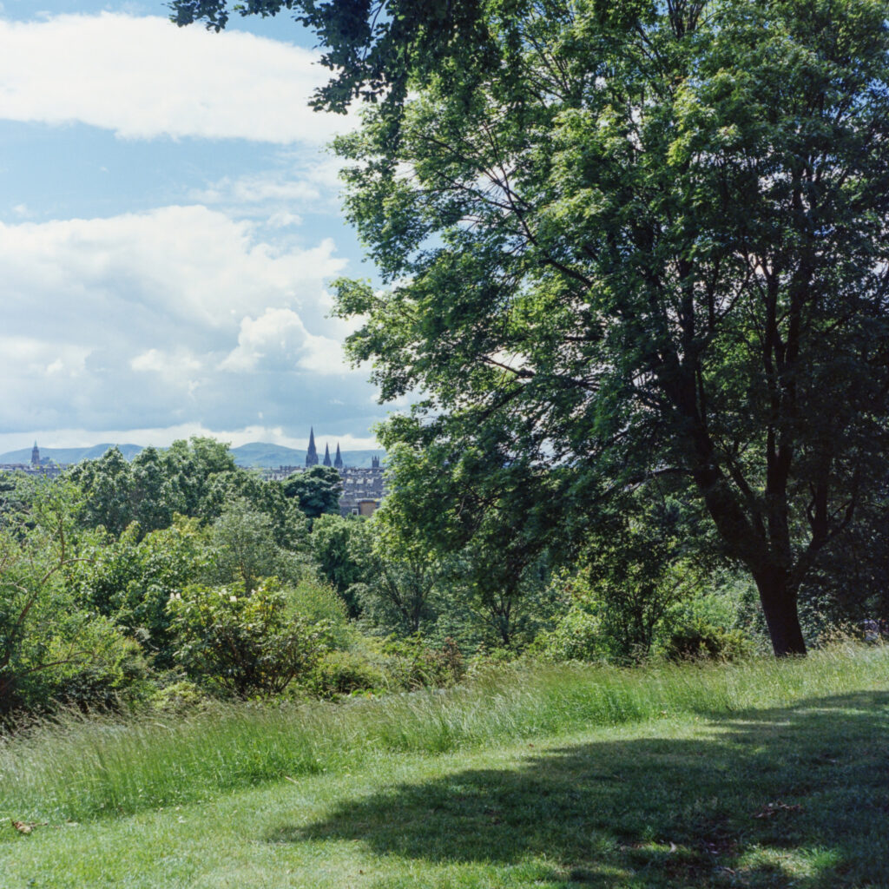
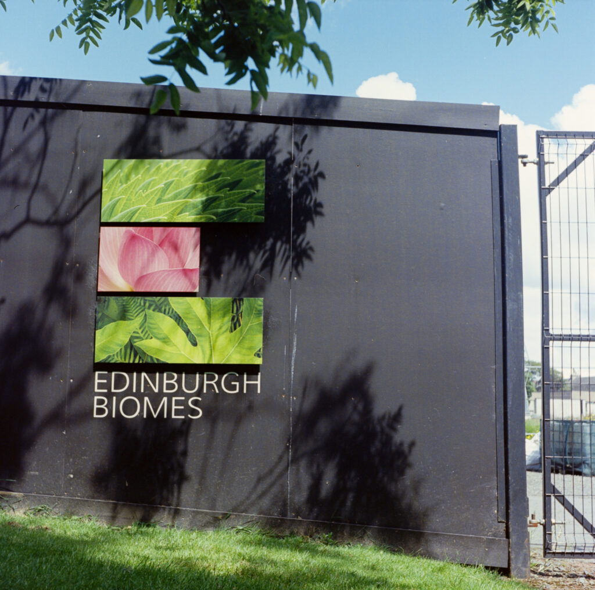
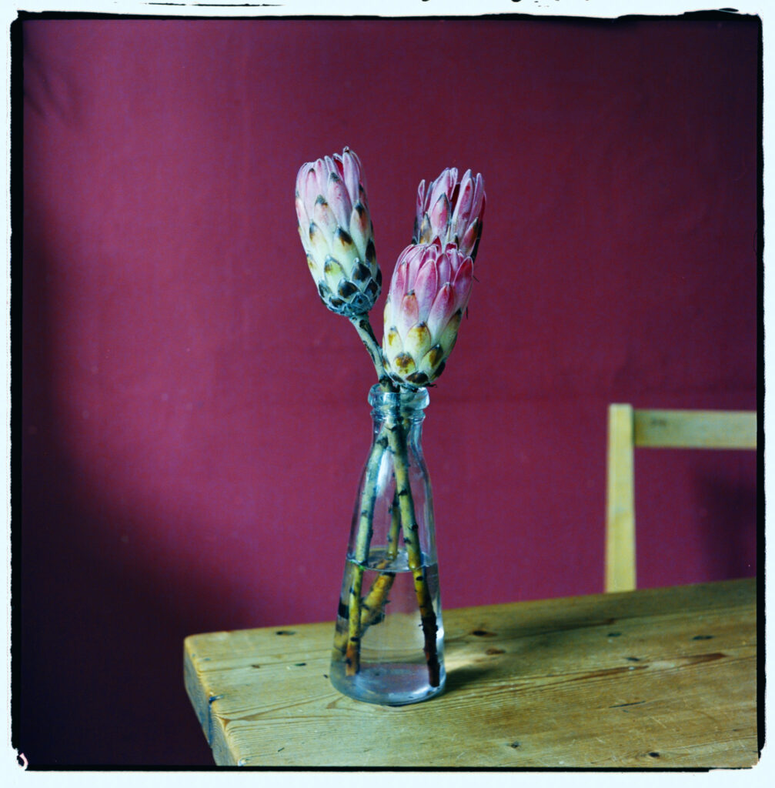
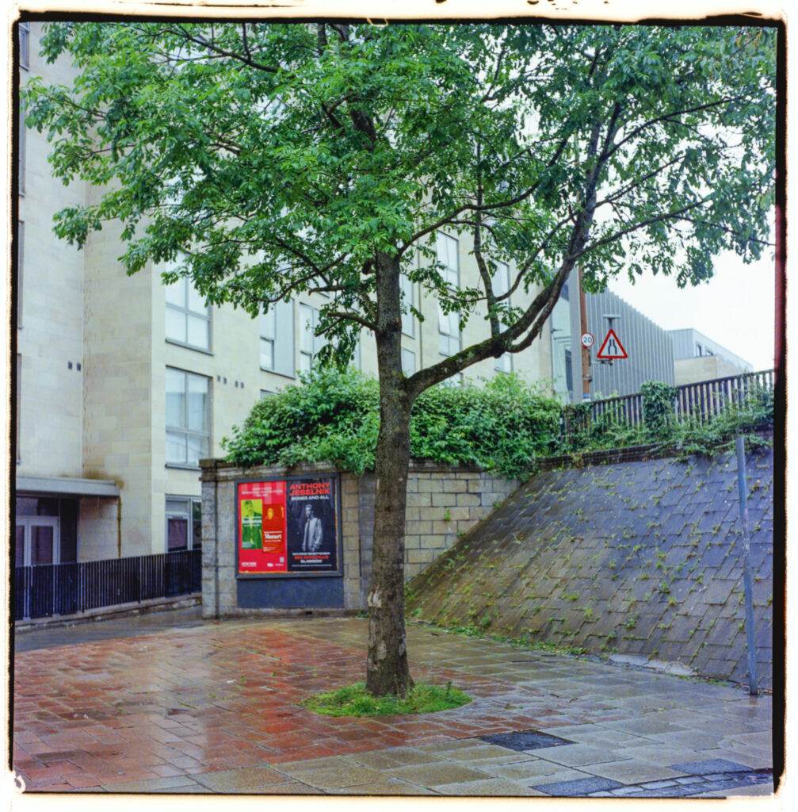

This is finishing up some Kodak Ektar 100 that was a few years out of date developed in some Cinestill CS41 that was six weeks old and probably coming to the end of its life. I'm shifting back to black and white now. I get my kicks from processing my own stuff which isn't practical with colour unless I shoot fifteen to twenty rolls a month and get the full value from each batch of chemistry.
