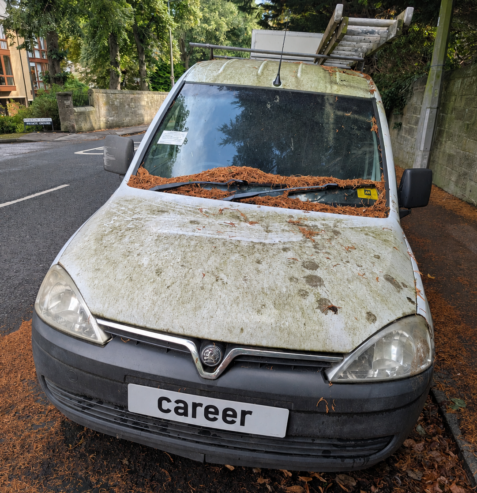

When I moved my blog posts from WordPress to this hosting system I came across my Curriculum Vitae.
For some reason I thought it was worth having a copy on the blog.
I don't think I have updated it for at least five years. 
As I'm planning to retire in 2030 it isn't likely that I'll be using it to look for work again
but I thought I'd capture it here just for curiosity.

My employment history starts nearly 40 years ago in 1988. I'd done shop and bar work before then but that was the first work "in my field".
I was employed as a compiler on the [RHS Dictionary of Gardening](https://www.amazon.co.uk/Dictionary-Gardening-Huxley-Griffiths-Editors/dp/1561590010).
This was a dense reference work covering all the plants of horticultural value. I bought myself an Amastrad PCW green screen word processor
and sat in my bedsit working through lists of plants. Here I am four decades later. Much water has flowed under the bridge but I'm still sitting
in my living room working on a reference work listing all the plants in the world. Grant you the computer is much fancier.

If I do need gainful employment I really need to do something completely different - stacking shelves or something - I'll be done with botanical nomenclature by the time I turn 65.

For stuff that has happened more recently there is always my [ResearchGate profile](https://www.researchgate.net/profile/Roger-Hyam-2) or [ORCID public profile](https://orcid.org/0000-0003-4581-1379). There are so many people compiling digital profiles of you now it hardly seems necessary to have a c.v. Employers can just use Google.

## Curriculum Vitae

I trained as a botanist but have also spent time working in commercial IT. I now combine these two interests in my work on biodiversity informatics. I am currently employed by the [Royal Botanic Garden Edinburgh](http://www.rbge.org.uk/) where my role is to ensure the gardens gain the most from their digital information assets and emerging digital technologies.

I am a practicing Buddhist. I have been meditating formally since the mid 1990s and currently sit with the [Edinburgh Wild Geese Sangha](http://edwildgeese.wordpress.com/) part of the [UK Community of Interbeing](http://interbeing.org.uk/) following the teachings of Vietnamese Zen Buddhist Master, Thich Nhat Hanh. I was ordained as a lay member of the Order of Interbeing in August 2015 with the Dharma name True Embracing Oak (Chân Sồi Bao Dung).

I don't see my Buddhism as a religion separate from pursuing the 'good life' ([*eudaemonia*](http://en.wikipedia.org/wiki/Eudaimonia)). I have an interest in the use of these principles as a force for good in wider society.

Way back in the 1980's I worked as a photographer of plants and gardens. Today I enjoy making portraits of willing subjects.

I live in Edinburgh, Scotland with my wife and two daughters.

I am hopeless at partitioning my life so all of the above overlaps in most of what I do.

### Education

1983 -- 1986 B.Sc. (Hons) Biological Sciences Wolverhampton Polytechnic\
1987 -- 1988 M.Sc. Pure and Applied Plant Taxonomy University of Reading\
1993 -- 1997 Ph.D. "[Molecular and conventional data sets and the systematics of](https://www.hyam.net/blog/archives/914) *[Rhododendron](https://www.hyam.net/blog/archives/914)* [L. subgenus](https://www.hyam.net/blog/archives/914) *[Hymenanthes](https://www.hyam.net/blog/archives/914)* [(Blume) K. Koch.](https://www.hyam.net/blog/archives/914)" Bristol University and Royal Botanic Garden Edinburgh\
1999 Sun Certified Programmer for the Java 2 Platform Sun Microsystems\
2011 Post Graduate Certificate in Mindfulness-Based Approaches, Bangor University

### Employment

2012 --  Digital Information & Technology Development Office, [Royal Botanic Garden Edinburgh](http://www.rbge.org.uk/).\
2011 -- 2012 [Encyclopedia of Life Rubenstein Fellow](http://www.eol.org/content/page/172):  Edinburgh Rhododendron monographs from OCR to species pages.\
2011 -- 2012 Project Officer: Synsthesys II -- Metadata on European Natural History Collections -- (half time post).\
2009 -- 2011 Project Officer: WP4 of Pan European Species Infrastructure, [Natural History Museum London](http://www.nhm.ac.uk/).\
2008 -- 2009 Developer: Biodiversity Collections Index.\
2005 -- 2008 Technical Architect: Biodiversity Information Standard (TDWG).\
2004 -- 2005 Freelance Biodiversity Informatics Consultant.\
2001 -- 2004 Senior Developer: Calligrafix, Lempitlaw, Kelso, TD5 8BN\
1999 -- 2001 Senior Developer/Team Leader: Orbital Software, Barnton, Edinburgh.\
1996 -- 1999 Higher Scientific Officer: Royal Botanic Garden Edinburgh\
1993 -- 1996 Scientific Officer: Royal Botanic Garden Edinburgh\
1992 -- 1993 Freelance Botanist writing Hyam and Pankhust (1995) Plants and Their Names.\
1990 -- 1992 Photographic Technician: University of Reading School of Plant Sciences\
1988 -- 1990 Freelance Botanist and Photographer

### Publications

Anton Güntsch, Quentin Groom, Roger Hyam, Simon Chagnoux, Dominik Röpert, Walter G. Berendsohn, Ana Casino, Gabriele Droege, Willfred Gerritsen, Jörg Holetschek, Karol Marhold, Patricia Mergen, Heimo Rainer, Vincent Stuart Smith, Dagmar Triebel (2018)  [Standardised Globally Unique Specimen Identifiers.](https://doi.org/10.3897/biss.2.26658) Biodiversity Information Science and Standards 2: e26658. [doi.org/10.3897/biss.2.26658](https://doi.org/10.3897/biss.2.26658)\
Hyam, R.D. (2017) [Automated  Image  Sampling  and  Classification  Can  Be  Used  to  Explore  Perceived  Naturalness  of  Urban  Spaces.](http://journals.plos.org/plosone/article?id=10.1371/journal.pone.0169357) PLOS one 12(1) doi: 10.1371/journal.pone.0169357\
Groom Q., Hyam R., Güntsch A.  (2017) [Data management: Stable identifiers for collection specimens.](http://www.nature.com/nature/journal/v546/n7656/full/546033d.html) Nature 546(33). doi:10.1038/546033d\
Güntsch A, Hyam R, Hagedorn G, Chagnoux S, Röpert D, Casino A, Droege G, Glöckler F, Gödderz K, Groom Q, Hoffmann J, Holleman A, Kempa M, Koivula H, Marhold K, Nicolson N, Smith VS, Triebel D. (2017) [Actionable, long-term stable and semantic web compatible identifiers for access to biological collection objects.](https://academic.oup.com/database/article/3053443/Actionable,) Database 2017(1). doi:10.1093/database/bax003\
Hyam, R.D. (2015) *[Taxa, Taxon Names and Globally Unique Identifiers in Perspective.](https://www.hyam.net/blog/archives/526)* in *Descriptive Taxonomy: The Foundation of Biodiversity Research.* [Systematics Association](http://www.systass.org/).\
de Jong Y, Kouwenberg J, Boumans L, Hussey C, Hyam R ... (104 more) ... Penev L, Rubio A, Backeljau T, Saarenmaa H, Ulenberg S (2015). [PESI -- A taxonomic backbone for Europe.](https://bdj.pensoft.net/articles.php?id=5848) Biodiversity Data Journal 3(e5848):pp. 1-51. doi: 10.3897/BDJ.3.e5848\
Hyam, R.D., Drinkwater, R.E. & Harris, D.J. (2012) *[Stable citations for herbarium specimens on the internet: an illustration from a taxonomic revision of Duboscia (Malvaceae)](http://www.mapress.com/phytotaxa/content/2012/f/pt00073p030.pdf)* Phytotaxa 73: 17--30.\
Hyam, R.D. (2010) *The use of Web Ontology Language (OWL) to Combine Extant Controlled Vocabularies in Biodiversity Informatics Appears Redundant.* Available from Nature Precedings <<http://dx.doi.org/10.1038/npre.2010.5168.1>>.\
Hyam, R.D. (2008) *TDWG Standards Roadmap.* Proceedings of TDWG, 2008.\
Hyam, R.D. (2008) *The Biodiversity Collections Index -- Linking 140 Million Records?* Proceedings of TDWG, 2008.\
Hyam, R.D. (2008) *SpeciesIndex: A Practical Alternative to Fantasy Mashups?* Proceedings of TDWG, 2008.\
Hyam, R.D. (2007) *TDWG Standards Architecture -- What and Why.* Proceedings of TDWG, 2007.\
Hyam, R.D. (2007) *RDF over TAPIR.* Proceedings of TDWG, 2007.\
Hyam, R.D. (2007) *The Role of Ontologies in the TDWG Architecture.* Proceedings of TDWG, 2007 .\
Kennedy, J., Hyam, R., Kukla, R., Paterson T. (2006) [*Standard Data Model Representation for Taxonomic Information*](http://www.hyam.net/publications/omi.2006.10.220.pdf) OMICS: A Journal of Integrative Biology. 10(2): 220-230. doi:10.1089/omi.2006.10.220.\
Hyam, R.D. (2006) *A Technical Architecture for TDWG Standards.* Proceedings of TDWG, 2006.\
Pereira, R.S., Donald Hobern, D., Hyam, R. Belbin, L., Blum, S. (2006) *Globally Unique Identifiers (GUID) for Biodiversity Informatics* Proceedings of TDWG, 2006.\
Kennedy, J., Gales, R., Kukla, R., Hyam, R., Wieczorek, J.R., Hagedorn, G., Döring, M., Vieglais, D. (2006) *Developing a Core Ontology for Taxonomic Data* Proceedings of TDWG, 2006.\
Miller, A.G., Morris, M., Alexander, D. (Design), Atkinson, R. (Editor), Pullan, M. (Bioinformatics), Hyam, R. (Bioinformatics), Kowter, A.M. (Logistics) (2004) *Ethnoflora of the Soqotra Archipelago.* The Royal Botanic Garden Edinburgh. [Winner of the Technical Category of CBHL awards 2005]\
Pullan, M.R., Watson, M.F., Kennedy, J.B., Raguenaud, C., Hyam, R. (2000) [*The Prometheus Taxonomic Model: A practical approach to representing multiple taxonomies*](http://www.hyam.net/publications/prometheus_1.pdf), Taxon 49(1), pp 55-75.\
Chamberlain, D.F., Hyam, R.D. (1998) *The genus Rhododendron: a case study to test the value of various molecular techniques as measures of biodiversity.* In: Karp, A., Isaac, P.G. & Ingram, D.S.(eds) Molecular Tools for Screening Biodiversity. Chapman & Hall.\
Chamberlain, D.F., Hyam, R.D., Argent, G., Fairweather, G., Walter, K.S. (1996) *The genus Rhododendron: Its classification and synonymy.* Royal Botanic Garden Edinburgh. (181pp)\
Hyam R.D. (1996) *Review of The Rhododendron Story: 200 years of Plant Hunting and Garden Cultivation.* The New Plantsman. 3(2): 124\
Hyam, R.D. (1995) *Draba*. In: Cullen, J. Alexander, J.C.M., Brady, A., Brickell, C.D., Green, P.S., Heywood, V.H., Jorgensen, P.-M., Jury, S.L., Knees, S.G., Leslie, A.C., Matthews, V.A., Robson, N.K.B., Walters, S.M., Wijnands, D.O. & Yeo, P.F. (eds) The European Garden Flora Vol. 4 Cambridge University Press.\
Hyam R.D. & Knees, S. (1995) *Echeveria and Crassula.* In: Cullen, J. Alexander, J.C.M., Brady, A., Brickell, C.D., Green, P.S., Heywood, V.H., Jorgensen, P.-M., Jury, S.L., Knees, S.G., Leslie, A.C., Matthews, V.A., Robson, N.K.B., Walters, S.M., Wijnands, D.O. & Yeo, P.F(eds) The European Garden Flora Vol. 4 Cambridge University Press.\
Hyam, R.D. & Pankhurst, R. (1995) *Plants and Their Names*. Oxford University Press. (545pp)\
Hyam, R.D. and Jury, S.L. (1990) *A review of the genus Graellsia Bois. including Draba L. section Helicodraba Schultz.* Botanical Journal of the Linnean Society. 102: 9-22.\
Hyam, R.D. (1990) *A review of The Roya Horticultural Society , Gardeners' Encyclopedia of Plants and Flowers.* Botanical Journal of the Linnean Society. 104: 389-390.\
Extensive Compilation and research for: Huxley, A., Griffiths, M. & Levy, M. (eds) (1992) The New Horticultural Society Dictionary of Gardening. Macmillan Press, London. and Moore, D.M. (1991) Plant Life. Oxford University Press